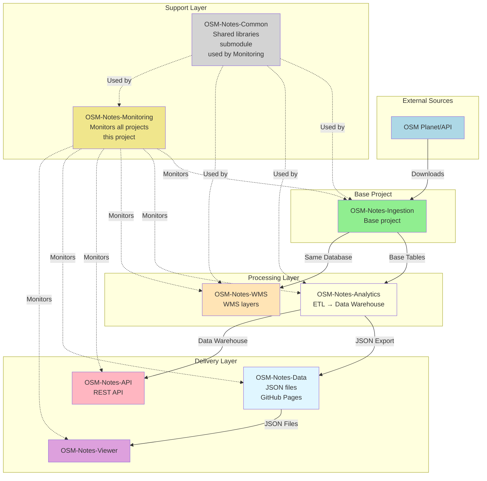

# OSM-Notes-Monitoring

**Centralized Monitoring, Alerting, and API Security for OpenStreetMap Notes**

This repository provides centralized monitoring, alerting, and security for the entire OSM Notes
ecosystem. It monitors all components, provides unified dashboards, and protects the API against
abuse and attacks.

## Overview

OSM-Notes-Monitoring is the operational command center for the OSM Notes ecosystem, providing:

- **Centralized Monitoring**: Single dashboard for all OSM Notes repositories
- **Unified Alerting**: Email, Slack, and other alert channels
- **API Security**: Rate limiting, DDoS protection, and abuse detection
- **Data Freshness**: Monitor data freshness across all sources
- **Performance Tracking**: Monitor performance metrics across all components
- **Security Monitoring**: Detect and respond to security incidents

## 📚 Ecosystem Documentation

For shared documentation of the complete ecosystem, see:

- **[OSM Notes Ecosystem](https://github.com/OSM-Notes/OSM-Notes)** - Ecosystem landing page
- **[Global Glossary](https://github.com/OSM-Notes/OSM-Notes-Common/blob/main/docs/Glossary.md)** - Terms and definitions
- **[Complete Installation Guide](https://github.com/OSM-Notes/OSM-Notes-Common/blob/main/docs/Installation.md)** - Step-by-step installation of all projects
- **[End-to-End Data Flow](https://github.com/OSM-Notes/OSM-Notes-Common/blob/main/docs/Data_Flow.md)** - Complete data flow
- **[Decision Guide](https://github.com/OSM-Notes/OSM-Notes-Common/blob/main/docs/Decision_Guide.md)** - Which project do I need?

---

## OSM-Notes Ecosystem

This monitoring project is part of the **OSM-Notes ecosystem**, consisting of 8 interconnected projects.
**OSM-Notes-Ingestion is the base project** - it was the first created and provides the foundation
for all others. **This Monitoring project monitors all other projects** in the ecosystem.

### Ecosystem Projects

1. **[OSM-Notes-Ingestion](https://github.com/OSM-Notes/OSM-Notes-Ingestion)** - **Base project**
   - Downloads and synchronizes OSM notes from Planet and API
   - Populates base PostgreSQL tables
   - First project created, foundation for all others

2. **[OSM-Notes-Analytics](https://github.com/OSM-Notes/OSM-Notes-Analytics)**
   - ETL processes and data warehouse
   - Generates analytics and datamarts
   - **Requires**: OSM-Notes-Ingestion (reads from base tables)

3. **[OSM-Notes-API](https://github.com/OSM-Notes/OSM-Notes-API)**
   - REST API for programmatic access
   - Provides dynamic queries and advanced features
   - **Requires**: OSM-Notes-Analytics (reads from data warehouse)

4. **[OSM-Notes-Viewer](https://github.com/OSM-Notes/OSM-Notes-Viewer)**
   - Web application for interactive visualization
   - Consumes JSON data from OSM-Notes-Data (GitHub Pages)
   - **Requires**: OSM-Notes-Data (which is generated by OSM-Notes-Analytics)

5. **[OSM-Notes-WMS](https://github.com/OSM-Notes/OSM-Notes-WMS)**
   - Web Map Service for geographic visualization
   - Publishes WMS layers for mapping applications
   - **Requires**: OSM-Notes-Ingestion (uses same database)

6. **[OSM-Notes-Monitoring](https://github.com/OSM-Notes/OSM-Notes-Monitoring)** (this project)
   - Centralized monitoring and alerting
   - Monitors all ecosystem components
   - **Requires**: Access to all other projects' databases/services

7. **[OSM-Notes-Common](https://github.com/OSM-Notes/OSM-Notes-Common)**
   - Shared Bash libraries and utilities
   - Used as Git submodule by multiple projects
   - **Used by**: Ingestion, Analytics, WMS, Monitoring (this project)

8. **[OSM-Notes-Data](https://github.com/OSM-Notes/OSM-Notes-Data)**
   - JSON data files exported from Analytics
   - Served via GitHub Pages
   - **Requires**: OSM-Notes-Analytics (generates and publishes the data)
   - **Consumed by**: Viewer (primary consumer), API (optional)

### Project Relationships



### Installation Order

When setting up the complete ecosystem, install projects in this order:

1. **OSM-Notes-Ingestion** - Install first (base project)
2. **OSM-Notes-Analytics** - Requires Ingestion
3. **OSM-Notes-WMS** - Requires Ingestion
4. **OSM-Notes-Data** - Requires Analytics (auto-generated by Analytics export script)
5. **OSM-Notes-Viewer** - Requires Data (consumes JSON from GitHub Pages)
6. **OSM-Notes-API** - Requires Analytics (reads from Analytics data warehouse)
7. **OSM-Notes-Monitoring** (this project) - Requires all others (monitors them) - Install last
8. **OSM-Notes-Common** - Used as submodule (no installation needed)

## Monitored Components

This system monitors the following repositories and components:

1. **OSM-Notes-Ingestion**: Data ingestion status, processing health, data quality
   - Integrates with existing monitoring scripts: `notesCheckVerifier.sh`,
     `processCheckPlanetNotes.sh`, `analyzeDatabasePerformance.sh`
   - Monitors: Database health, API sync status, Planet processing, data freshness
   - See [Existing Monitoring Components](./docs/Existing_Monitoring_Components.md) for details

2. **OSM-Notes-Analytics**: DWH/ETL job status, data freshness, query performance
   - Monitors: ETL execution, datamart updates, data warehouse health, query performance

3. **OSM-Notes-API**: API availability, rate limiting, security incidents
   - Monitors: API uptime, response times, rate limiting events, security threats

4. **OSM-Notes-Viewer**: Service availability, GitHub Pages deployment status
   - Monitors: GitHub Pages availability, data loading performance

5. **OSM-Notes-WMS**: Service availability, response times, tile generation
   - Monitors: GeoServer status, WMS layer availability, tile generation performance

6. **OSM-Notes-Data**: Backup freshness, repository sync status
   - Monitors: JSON file freshness, GitHub Pages sync, export timestamps

7. **OSM-Notes-Common**: Submodule version consistency
   - Monitors: Submodule version alignment across projects

8. **Infrastructure**: Server resources, database health, network connectivity
   - Monitors: CPU, memory, disk usage, database connections, network latency

## Requirements

### Application Requirements

For complete installation instructions, see **[Installation and Dependencies Guide](docs/Installation_Dependencies.md)**.

- **PostgreSQL** (for metrics storage in monitoring database)
- **Bash** 4.0 or higher
- **Standard UNIX utilities**: grep, awk, sed, curl
- **Email client**: mutt (for email alerts)
- **HTTP client**: curl (for HTTP health checks)

### Internal Repository Requirements

- **OSM-Notes-Ingestion** ⚠️ **REQUIRED**
  - Access to Ingestion database (`notes`) for monitoring data quality and sync status
- **OSM-Notes-Analytics** ⚠️ **REQUIRED**
  - Access to Analytics database (`osm_notes_dwh` or `notes_dwh`) for monitoring ETL status
- **OSM-Notes-API** (optional but recommended)
  - Access to API service for monitoring availability and performance
- **OSM-Notes-WMS** (optional but recommended)
  - Access to WMS/GeoServer for monitoring service availability
- **OSM-Notes-Data** (optional but recommended)
  - Access to GitHub repository for monitoring data freshness

**Note**: Monitoring can be installed with access to only some projects, but full monitoring requires access to all monitored components.

## Recommended Reading Path

**New to this project?** Follow this reading path to understand Monitoring (~1.5-2 hours):

### For System Administrators

1. **Start Here** (20 min)
   - Read this README.md (you're here!)
   - Understand the project purpose and monitored components
   - Review the Overview section above

2. **Quick Start** (30 min)
   - Follow Quick Start guide below
   - Set up monitoring database
   - Configure basic monitoring

3. **Configuration** (30 min)
   - [docs/CONFIGURATION_REFERENCE.md](./docs/Configuration_Reference.md) - All configuration options (20 min)
   - [docs/QUICK_START_GUIDE.md](./docs/Quick_Start_Guide.md) - Detailed setup (10 min)

4. **Operations** (30 min)
   - [docs/USER_GUIDE.md](./docs/User_Guide.md) - User documentation (15 min)
   - [docs/ALERTING_GUIDE.md](./docs/Alerting_Guide.md) - Alert system usage (15 min)

**Total time: ~2 hours** for complete setup and operations.

### For Developers

1. **Foundation** (45 min)
   - [docs/Monitoring_Architecture_Proposal.md](./docs/Monitoring_Architecture_Proposal.md) - System architecture (30 min)
   - [docs/API_Security_Design.md](./docs/API_Security_Design.md) - Security design (15 min)

2. **Component Monitoring** (1 hour)
   - [docs/INGESTION_MONITORING_GUIDE.md](./docs/Ingestion_Monitoring_Guide.md) - Monitor ingestion (20 min)
   - [docs/ANALYTICS_MONITORING_GUIDE.md](./docs/Analytics_Monitoring_Guide.md) - Monitor analytics (20 min)
   - [docs/API_SECURITY_GUIDE.md](./docs/API_Security_Guide.md) - API security features (20 min)

3. **Deep Dive** (as needed)
   - [docs/IMPLEMENTATION_PLAN.md](./docs/Implementation_Plan.md) - Implementation plan
   - [docs/CODING_STANDARDS.md](./docs/Coding_Standards.md) - Coding standards
   - [docs/README.md](./docs/README.md) - Complete documentation index

**Total time: ~2.5 hours** for complete developer overview.

## Architecture Decision Records

Architecture Decision Records (ADRs) document important architectural decisions made in this project:
- [View all ADRs](docs/adr/)
- [Central ADR Index](https://github.com/OSM-Notes/OSM-Notes-Common/blob/main/docs/adr/README.md)

## Entry Points

**Main entry points** for using and operating Monitoring:

### Monitoring Script Entry Points

1. **Monitor Ingestion** (`bin/monitor/monitorIngestion.sh`)
   ```bash
   # Monitor OSM-Notes-Ingestion component
   ./bin/monitor/monitorIngestion.sh
   ```

2. **Monitor Analytics** (`bin/monitor/monitorAnalytics.sh`)
   ```bash
   # Monitor OSM-Notes-Analytics component
   ./bin/monitor/monitorAnalytics.sh
   ```

3. **Monitor API** (`bin/monitor/monitorAPI.sh`)
   ```bash
   # Monitor OSM-Notes-API component
   ./bin/monitor/monitorAPI.sh
   ```

4. **Monitor WMS** (`bin/monitor/monitorWMS.sh`)
   ```bash
   # Monitor OSM-Notes-WMS component
   ./bin/monitor/monitorWMS.sh
   ```

5. **Monitor Data** (`bin/monitor/monitorData.sh`)
   ```bash
   # Monitor OSM-Notes-Data freshness
   ./bin/monitor/monitorData.sh
   ```

6. **Monitor Infrastructure** (`bin/monitor/monitorInfrastructure.sh`)
   ```bash
   # Monitor system infrastructure (CPU, memory, disk)
   ./bin/monitor/monitorInfrastructure.sh
   ```

### Metric Collection Entry Points

1. **Collect Database Metrics** (`bin/monitor/collectDatabaseMetrics.sh`)
   ```bash
   # Collect database performance metrics
   ./bin/monitor/collectDatabaseMetrics.sh
   ```

2. **Collect ETL Metrics** (`bin/monitor/collect_etl_metrics.sh`)
   ```bash
   # Collect ETL job metrics from Analytics
   ./bin/monitor/collect_etl_metrics.sh
   ```

3. **Collect System Metrics** (`bin/monitor/collectSystemMetrics.sh`)
   ```bash
   # Collect system-level metrics
   ./bin/monitor/collectSystemMetrics.sh
   ```

### Alerting Entry Points

1. **Alert Manager** (`bin/alerts/alertManager.sh`)
   ```bash
   # Manage and send alerts
   ./bin/alerts/alertManager.sh
   ```

2. **Send Alert** (`bin/alerts/sendAlert.sh`)
   ```bash
   # Send individual alert
   ./bin/alerts/sendAlert.sh [severity] [message]
   ```

3. **Alert Rules** (`bin/alerts/alertRules.sh`)
   ```bash
   # Configure and manage alert rules
   ./bin/alerts/alertRules.sh
   ```

### Security Entry Points

1. **Rate Limiter** (`bin/security/rateLimiter.sh`)
   ```bash
   # Manage rate limiting for API
   ./bin/security/rateLimiter.sh
   ```

2. **IP Blocking** (`bin/security/ipBlocking.sh`)
   ```bash
   # Manage IP whitelist/blacklist
   ./bin/security/ipBlocking.sh
   ```

3. **Abuse Detection** (`bin/security/abuseDetection.sh`)
   ```bash
   # Detect and respond to abuse patterns
   ./bin/security/abuseDetection.sh
   ```

4. **DDoS Protection** (`bin/security/ddosProtection.sh`)
   ```bash
   # DDoS detection and mitigation
   ./bin/security/ddosProtection.sh
   ```

### Dashboard Entry Points

1. **Update Dashboard** (`bin/dashboard/updateDashboard.sh`)
   ```bash
   # Update monitoring dashboard with latest metrics
   ./bin/dashboard/updateDashboard.sh
   ```

2. **Generate Metrics** (`bin/dashboard/generateMetrics.sh`)
   ```bash
   # Generate metrics for dashboard visualization
   ./bin/dashboard/generateMetrics.sh
   ```

### Configuration Entry Point

- **Monitoring Properties**: `etc/properties.sh` - Main configuration file
  ```bash
  # Copy example and configure
  cp etc/properties.sh.example etc/properties.sh
  vi etc/properties.sh
  ```

- **Alert Configuration**: `config/alerts.conf` - Alert settings
  ```bash
  export ADMIN_EMAIL="admin@example.com"
  export SEND_ALERT_EMAIL="true"
  ```

See [docs/CONFIGURATION_REFERENCE.md](./docs/Configuration_Reference.md) for complete configuration options.

## Quick Start

### Installation

1. Clone the repository:

```bash
git clone https://github.com/OSM-Notes/OSM-Notes-Monitoring.git
cd OSM-Notes-Monitoring
```

2. Configure monitoring:

```bash
cp etc/properties.sh.example etc/properties.sh
# Edit etc/properties.sh with your configuration
```

3. Set up monitoring database:

```bash
# Create monitoring database (this project's own database)
# Development: osm_notes_monitoring
# Production: notes_monitoring
createdb osm_notes_monitoring

# Run initialization scripts
psql -d osm_notes_monitoring -f sql/init.sql

# Grant permissions to monitoring user (required!)
# Replace 'osm_notes_monitoring_user' with your actual database user
psql -d osm_notes_monitoring -c "GRANT SELECT, INSERT, UPDATE ON ALL TABLES IN SCHEMA public TO osm_notes_monitoring_user;"
psql -d osm_notes_monitoring -c "GRANT USAGE, SELECT ON ALL SEQUENCES IN SCHEMA public TO osm_notes_monitoring_user;"
psql -d osm_notes_monitoring -c "GRANT EXECUTE ON ALL FUNCTIONS IN SCHEMA public TO osm_notes_monitoring_user;"
psql -d osm_notes_monitoring -c "ALTER DEFAULT PRIVILEGES IN SCHEMA public GRANT SELECT, INSERT, UPDATE ON TABLES TO osm_notes_monitoring_user;"
psql -d osm_notes_monitoring -c "ALTER DEFAULT PRIVILEGES IN SCHEMA public GRANT USAGE, SELECT ON SEQUENCES TO osm_notes_monitoring_user;"
psql -d osm_notes_monitoring -c "ALTER DEFAULT PRIVILEGES IN SCHEMA public GRANT EXECUTE ON FUNCTIONS TO osm_notes_monitoring_user;"
psql -d osm_notes_monitoring -c "GRANT USAGE ON SCHEMA public TO osm_notes_monitoring_user;"

# Apply query performance optimizations (recommended)
psql -d osm_notes_monitoring -f sql/optimize_queries.sql
```

**Note:** This project requires:

- **Its own database** (`osm_notes_monitoring` / `notes_monitoring`) to store metrics, alerts, and
  security events
- **Access to monitored databases** (`notes` for ingestion, `notes_dwh` for analytics) to read data
  for monitoring
- Configure `INGESTION_DBNAME` and `ANALYTICS_DBNAME` in `etc/properties.sh` if different from
  defaults

4. Configure alerts:

```bash
# Edit config/alerts.conf
export ADMIN_EMAIL="admin@example.com"
export SEND_ALERT_EMAIL="true"
```

## Architecture

For detailed architecture documentation, see:

- [Monitoring Architecture Proposal](./docs/Monitoring_Architecture_Proposal.md)
- [API Security Design](./docs/API_Security_Design.md)
- [Monitoring Resumen Ejecutivo](./docs/Monitoring_Resumen_Ejecutivo.md) (Spanish)
- [Existing Monitoring Components](./docs/Existing_Monitoring_Components.md): Integration with
  OSM-Notes-Ingestion monitoring scripts
- [Grafana Architecture](./docs/Grafana_Architecture.md): Dual Grafana deployment (API + Monitoring)
- [Query Performance Optimization](./docs/Query_Performance_Optimization.md): SQL query optimization
  guide
- [Security Audit Guide](./docs/Security_Audit_Guide.md): Code-level security checks
- [Vulnerability Scanning Guide](./docs/Vulnerability_Scanning_Guide.md): Automated vulnerability
  detection
- [Penetration Testing Guide](./docs/Penetration_Testing_Guide.md): Security penetration testing
  procedures
- [Code Coverage Instrumentation](./docs/Code_Coverage_Instrumentation.md): Using bashcov for real
  coverage measurement
- [Code Coverage Explanation](./docs/Coverage_Explanation.md): Understanding estimated vs
  instrumented coverage and how to improve it

## Features

### Monitoring

- **Component Health**: Monitor all OSM Notes repositories
- **Data Quality**: Track data integrity and freshness
- **Performance**: Monitor response times and resource usage
- **Dependencies**: Track cross-repository dependencies

### Security

- **Rate Limiting**: Per-IP, per-API-key, per-endpoint limits
- **DDoS Protection**: Automatic detection and mitigation
- **Abuse Detection**: Pattern analysis and automatic blocking
- **IP Management**: Whitelist, blacklist, temporary blocks

### Alerting

- **Email Alerts**: Immediate notifications for critical issues
- **Slack Integration**: Team notifications
- **Escalation**: Automatic escalation for critical alerts
- **Alert Management**: Deduplication and alert history

### Dashboards

- **Grafana Dashboards**: Professional time-series visualization
- **Custom Dashboards**: HTML-based dashboards for quick checks
- **CLI Tools**: Command-line dashboards

## Project Structure

```
OSM-Notes-Monitoring/
├── bin/                    # Executable scripts
│   ├── monitor/           # Monitoring scripts per component
│   ├── security/          # Security scripts (rate limiting, DDoS)
│   ├── alerts/            # Alerting system
│   ├── dashboard/         # Dashboard generation
│   └── lib/               # Shared library functions
├── sql/                   # SQL monitoring queries
│   ├── ingestion/         # Ingestion monitoring queries
│   ├── analytics/         # Analytics monitoring queries
│   ├── wms/               # WMS monitoring queries
│   ├── api/               # API monitoring queries
│   ├── data/              # Data freshness queries
│   ├── infrastructure/    # Infrastructure queries
│   └── init.sql           # Database initialization script
├── config/                # Configuration files
│   ├── monitoring.conf.example    # Monitoring configuration template
│   ├── alerts.conf.example        # Alert configuration template
│   ├── security.conf.example      # Security configuration template
│   └── dashboards/                # Dashboard configuration files
│       ├── grafana/               # Grafana dashboard configs
│       └── custom/                # Custom dashboard configs
├── dashboards/            # Dashboard files (Grafana JSON, HTML)
│   ├── grafana/           # Grafana dashboard JSON files
│   └── html/              # HTML dashboard files
├── metrics/               # Metrics storage (runtime data)
│   ├── ingestion/         # Ingestion metrics
│   ├── analytics/         # Analytics metrics
│   ├── wms/               # WMS metrics
│   ├── api/               # API metrics
│   └── infrastructure/    # Infrastructure metrics
├── etc/                   # Main configuration
│   └── properties.sh.example  # Main properties template
├── logs/                  # Monitoring logs (runtime)
├── docs/                  # Documentation
└── tests/                 # Test suite
    ├── unit/              # Unit tests
    ├── integration/       # Integration tests
    └── mock_commands/     # Mock commands for testing
```

**Note:**

- `config/dashboards/` contains configuration files for dashboards
- `dashboards/` contains the actual dashboard files (Grafana JSON, HTML)
- `etc/properties.sh` is the main system configuration file (copy from `.example`)
- `config/monitoring.conf` contains monitoring-specific settings (copy from `.example`)
- `config/alerts.conf` and `config/security.conf` are component-specific configurations (copy from
  `.example`)

## Usage

### Monitor Ingestion

```bash
./bin/monitor/monitorIngestion.sh
```

### Monitor Analytics

```bash
./bin/monitor/monitorAnalytics.sh
```

### Monitor API Security

```bash
./bin/security/rateLimiter.sh check 192.168.1.100 /api/notes
```

### View Dashboard

```bash
# Start Grafana (if configured)
# Or view HTML dashboard
open dashboards/html/overview.html
```

## Code Coverage

This project uses **two complementary methods** to measure code coverage:

### Quick Coverage Check (Estimated)

```bash
bash scripts/generate_coverage_report.sh
# Fast: Shows estimated coverage based on test file presence
# Output: coverage/coverage_report.txt
```

### Detailed Coverage Analysis (Instrumented)

```bash
# Run in background (takes hours)
bash scripts/run_bashcov_background.sh start

# Monitor progress
bash scripts/monitor_bashcov.sh

# Check status
bash scripts/run_bashcov_background.sh status
# Output: coverage/coverage_report_instrumented.txt
```

### Combined Report (Both Side by Side)

```bash
bash scripts/generate_coverage_combined.sh
# Shows estimated vs instrumented coverage comparison
# Output: coverage/coverage_report_combined.txt
```

**Understanding the Numbers:**

- **Estimated (80%)**: "We have tests for 80% of scripts" - Fast, optimistic
- **Instrumented (27%)**: "27% of code lines are executed during tests" - Slow, accurate
- **Gap (53%)**: Normal for unit tests with mocks - indicates tests exist but don't execute full
  code paths

For detailed explanation, see: [Code Coverage Explanation](./docs/Coverage_Explanation.md)

## Configuration

### Quick Setup

Generate configuration files:

```bash
# Interactive mode (recommended)
./scripts/generate_config.sh -i

# Or generate with defaults
./scripts/generate_config.sh -a
```

### Configuration Files

- **Main Config**: `etc/properties.sh` - Database, intervals, logging
- **Monitoring Config**: `config/monitoring.conf` - Component-specific settings
- **Alert Config**: `config/alerts.conf` - Email, Slack, alert routing
- **Security Config**: `config/security.conf` - Rate limiting, DDoS protection
- **Log Rotation**: `config/logrotate.conf` - Log rotation configuration

### Documentation

For complete configuration reference, see:

- **[Configuration Reference](./docs/Configuration_Reference.md)**: All configuration options
  documented
- **[Logging Guide](./docs/Logging.md)**: Logging setup, rotation, and best practices
- **[Logging Best Practices](./docs/Logging_Best_Practices.md)**: Comprehensive logging guidelines
  and patterns
- **[Adapting Scripts](./docs/Adapting_Scripts.md)**: Guide for adapting existing scripts to use
  shared libraries

## Documentation

### Getting Started

- **[Quick Start Guide](./docs/Quick_Start_Guide.md)**: Get up and running in 15 minutes
- **[User Guide](./docs/User_Guide.md)**: Comprehensive user documentation
- **[Setup Guide](./docs/Monitoring_Setup_Guide.md)**: Detailed setup instructions
- **[Documentation Index](./docs/Documentation_Index.md)**: Complete index of all documentation

### Configuration and Usage

- **[Configuration Reference](./docs/Configuration_Reference.md)**: All configuration options
- **[Dashboard Guide](./docs/Dashboard_Guide.md)**: Using dashboards
- **[Alerting Guide](./docs/Alerting_Guide.md)**: Alert system usage
- **[Grafana Setup Guide](./docs/Grafana_Setup_Guide.md)**: Grafana dashboard setup

### Component Monitoring

- **[Ingestion Monitoring Guide](./docs/Ingestion_Monitoring_Guide.md)**: Monitor ingestion
  component
- **[Analytics Monitoring Guide](./docs/Analytics_Monitoring_Guide.md)**: Monitor analytics/DWH
  component
- **[WMS Monitoring Guide](./docs/WMS_Monitoring_Guide.md)**: Monitor WMS service
- **[Infrastructure Monitoring Guide](./docs/Infrastructure_Monitoring_Guide.md)**: Monitor
  infrastructure
- **[API Security Guide](./docs/API_Security_Guide.md)**: API security features

### Architecture and Development

- **[Architecture Proposal](./docs/Monitoring_Architecture_Proposal.md)**: Complete system
  architecture
- **[API Security Design](./docs/API_Security_Design.md)**: Security and protection mechanisms
- **[Implementation Plan](./docs/Implementation_Plan.md)**: Detailed implementation plan with
  testing and standards
- **[Coding Standards](./docs/Coding_Standards.md)**: Coding standards and best practices
- **[Resumen Ejecutivo](./docs/Monitoring_Resumen_Ejecutivo.md)**: Executive summary (Spanish)
- **[Existing Monitoring Components](./docs/Existing_Monitoring_Components.md)**: Integration with
  OSM-Notes-Ingestion monitoring scripts

### Production Deployment

- **[Deployment Guide](./docs/Deployment_Guide.md)**: General production deployment guide
- **[Pre-Deployment Checklist](./docs/Pre_Deployment_Checklist.md)**: Checklist before production
  deployment

## Related Repositories

For complete information about the OSM-Notes ecosystem and all 8 projects, see the
[OSM-Notes Ecosystem](#osm-notes-ecosystem) section above.

All monitored repositories:
- [OSM-Notes-Ingestion](https://github.com/OSM-Notes/OSM-Notes-Ingestion) - Data ingestion (base project)
- [OSM-Notes-Analytics](https://github.com/OSM-Notes/OSM-Notes-Analytics) - DWH and analytics
- [OSM-Notes-API](https://github.com/OSM-Notes/OSM-Notes-API) - REST API
- [OSM-Notes-Viewer](https://github.com/OSM-Notes/OSM-Notes-Viewer) - Web visualization
- [OSM-Notes-WMS](https://github.com/OSM-Notes/OSM-Notes-WMS) - WMS service
- [OSM-Notes-Data](https://github.com/OSM-Notes/OSM-Notes-Data) - JSON data files
- [OSM-Notes-Common](https://github.com/OSM-Notes/OSM-Notes-Common) - Shared libraries

## Contributing

See [CONTRIBUTING.md](./CONTRIBUTING.md) for contribution guidelines.

## GDPR Compliance

**Important:** This monitoring system accesses databases and services that process personal data from OpenStreetMap, including usernames and geographic locations. We are committed to GDPR compliance.

GDPR compliance mechanisms are implemented in the base project **OSM-Notes-Ingestion**. For detailed information about GDPR compliance, data processing, retention, and data subject rights, please refer to:

- **GDPR Privacy Policy:** [OSM-Notes-Ingestion/docs/GDPR_Privacy_Policy.md](https://github.com/OSM-Notes/OSM-Notes-Ingestion/blob/main/docs/GDPR_Privacy_Policy.md)
- **GDPR Procedures:** [OSM-Notes-Ingestion/docs/GDPR_Procedures.md](https://github.com/OSM-Notes/OSM-Notes-Ingestion/blob/main/docs/GDPR_Procedures.md) - Procedures for handling data subject requests

This Monitoring project monitors all ecosystem components and accesses data that is subject to GDPR compliance measures implemented in OSM-Notes-Ingestion.

## License

This project is licensed under the GNU General Public License v3.0 - see the [LICENSE](./LICENSE)
file for details.

## Status

✅ **Production Ready** - All phases completed. System ready for production deployment.

---

**Author:** Andres Gomez (AngocA)  
**Version:** 1.0.0  
**Last Updated:** 2026-01-09
