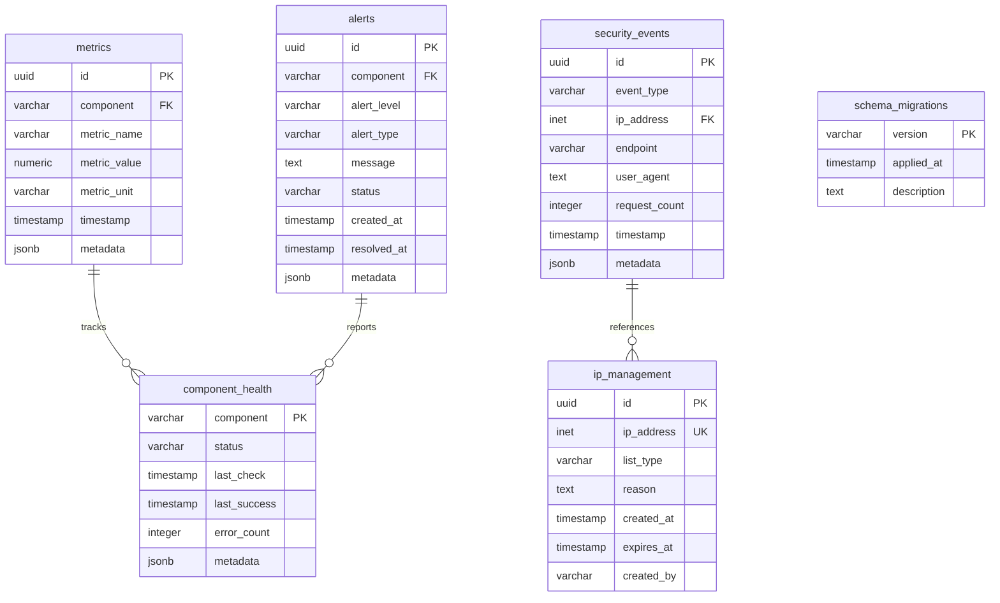

# Database Schema Documentation

> **Last Updated:** 2025-12-31  
> **Database:** `osm_notes_monitoring` (development) / `notes_monitoring` (production)  
> **Version:** 1.0.0

## Overview

The OSM-Notes-Monitoring database stores monitoring metrics, alerts, security events, and component
health status for the entire OSM Notes ecosystem.

### Database Architecture

This project uses **its own dedicated database** separate from the databases it monitors:

- **Monitoring Database** (`osm_notes_monitoring` / `notes_monitoring`): Stores all monitoring data
  - Metrics from all components
  - Alerts and alert history
  - Security events and IP management
  - Component health status

- **Monitored Databases** (read-only access):
  - `notes` (OSM-Notes-Ingestion): Monitored for ingestion metrics
  - `notes_dwh` (OSM-Notes-Analytics): Monitored for analytics/DWH metrics

This separation ensures:

- Monitoring data doesn't interfere with production databases
- Independent scaling and maintenance
- Clear separation of concerns

## Entity Relationship Diagram



## Tables

### `metrics`

Stores time-series monitoring data for all components.

**Columns:**

| Column         | Type                     | Constraints                             | Description                                                           |
| -------------- | ------------------------ | --------------------------------------- | --------------------------------------------------------------------- |
| `id`           | UUID                     | PRIMARY KEY, DEFAULT uuid_generate_v4() | Unique identifier                                                     |
| `component`    | VARCHAR(50)              | NOT NULL, CHECK                         | Component name (ingestion, analytics, wms, api, data, infrastructure) |
| `metric_name`  | VARCHAR(100)             | NOT NULL                                | Name of the metric (e.g., "processing_time", "error_rate")            |
| `metric_value` | NUMERIC                  |                                         | Numeric value of the metric                                           |
| `metric_unit`  | VARCHAR(20)              |                                         | Unit of measurement (ms, %, count, bytes, etc.)                       |
| `timestamp`    | TIMESTAMP WITH TIME ZONE | DEFAULT CURRENT_TIMESTAMP               | When the metric was recorded                                          |
| `metadata`     | JSONB                    |                                         | Additional metadata (tags, labels, context)                           |

**Indexes:**

- `idx_metrics_component_timestamp` on (component, timestamp DESC)
- `idx_metrics_metric_name` on (metric_name)
- `idx_metrics_timestamp` on (timestamp DESC)
- `idx_metrics_component_metric_timestamp` on (component, metric_name, timestamp DESC)
- `idx_metrics_metadata` GIN on (metadata) WHERE metadata IS NOT NULL

**Example:**

```sql
INSERT INTO metrics (component, metric_name, metric_value, metric_unit)
VALUES ('ingestion', 'processing_time', 123.45, 'ms');
```

---

### `alerts`

Stores alert history and status for all monitored components.

**Columns:**

| Column        | Type                     | Constraints                             | Description                                                  |
| ------------- | ------------------------ | --------------------------------------- | ------------------------------------------------------------ |
| `id`          | UUID                     | PRIMARY KEY, DEFAULT uuid_generate_v4() | Unique identifier                                            |
| `component`   | VARCHAR(50)              | NOT NULL                                | Component name                                               |
| `alert_level` | VARCHAR(20)              | NOT NULL, CHECK                         | Severity: critical, warning, info                            |
| `alert_type`  | VARCHAR(100)             | NOT NULL                                | Type/category of alert (e.g., "data_quality", "performance") |
| `message`     | TEXT                     | NOT NULL                                | Alert message                                                |
| `status`      | VARCHAR(20)              | DEFAULT 'active', CHECK                 | Status: active, resolved, acknowledged                       |
| `created_at`  | TIMESTAMP WITH TIME ZONE | DEFAULT CURRENT_TIMESTAMP               | When alert was created                                       |
| `resolved_at` | TIMESTAMP WITH TIME ZONE |                                         | When alert was resolved (NULL if active)                     |
| `metadata`    | JSONB                    |                                         | Additional alert context                                     |

**Indexes:**

- `idx_alerts_component_status` on (component, status)
- `idx_alerts_level_created` on (alert_level, created_at DESC)
- `idx_alerts_status_created` on (status, created_at DESC)
- `idx_alerts_component_type` on (component, alert_type)
- `idx_alerts_metadata` GIN on (metadata) WHERE metadata IS NOT NULL

**Example:**

```sql
INSERT INTO alerts (component, alert_level, alert_type, message)
VALUES ('ingestion', 'critical', 'data_quality', 'Data quality check failed');
```

---

### `security_events`

Stores security-related events (rate limiting, DDoS, abuse detection).

**Columns:**

| Column          | Type                     | Constraints                             | Description                                   |
| --------------- | ------------------------ | --------------------------------------- | --------------------------------------------- |
| `id`            | UUID                     | PRIMARY KEY, DEFAULT uuid_generate_v4() | Unique identifier                             |
| `event_type`    | VARCHAR(50)              | NOT NULL, CHECK                         | Type: rate_limit, ddos, abuse, block, unblock |
| `ip_address`    | INET                     |                                         | IP address associated with the event          |
| `endpoint`      | VARCHAR(255)             |                                         | API endpoint accessed (if applicable)         |
| `user_agent`    | TEXT                     |                                         | User agent string                             |
| `request_count` | INTEGER                  | DEFAULT 1                               | Number of requests in this event              |
| `timestamp`     | TIMESTAMP WITH TIME ZONE | DEFAULT CURRENT_TIMESTAMP               | When event occurred                           |
| `metadata`      | JSONB                    |                                         | Additional event details                      |

**Indexes:**

- `idx_security_events_type_timestamp` on (event_type, timestamp DESC)
- `idx_security_events_ip` on (ip_address)
- `idx_security_events_timestamp` on (timestamp DESC)
- `idx_security_events_ip_timestamp` on (ip_address, timestamp DESC)
- `idx_security_events_metadata` GIN on (metadata) WHERE metadata IS NOT NULL

**Example:**

```sql
INSERT INTO security_events (event_type, ip_address, endpoint)
VALUES ('rate_limit', '192.168.1.100', '/api/notes');
```

---

### `ip_management`

Manages IP whitelist, blacklist, and temporary blocks.

**Columns:**

| Column       | Type                     | Constraints                             | Description                            |
| ------------ | ------------------------ | --------------------------------------- | -------------------------------------- |
| `id`         | UUID                     | PRIMARY KEY, DEFAULT uuid_generate_v4() | Unique identifier                      |
| `ip_address` | INET                     | NOT NULL, UNIQUE                        | IP address                             |
| `list_type`  | VARCHAR(20)              | NOT NULL, CHECK                         | Type: whitelist, blacklist, temp_block |
| `reason`     | TEXT                     |                                         | Reason for adding IP to list           |
| `created_at` | TIMESTAMP WITH TIME ZONE | DEFAULT CURRENT_TIMESTAMP               | When IP was added                      |
| `expires_at` | TIMESTAMP WITH TIME ZONE |                                         | Expiration time (NULL for permanent)   |
| `created_by` | VARCHAR(100)             |                                         | Who added the IP (user/system)         |

**Indexes:**

- `idx_ip_management_ip_type` on (ip_address, list_type)
- `idx_ip_management_expires` on (expires_at) WHERE expires_at IS NOT NULL

**Example:**

```sql
INSERT INTO ip_management (ip_address, list_type, reason, expires_at)
VALUES ('192.168.1.100', 'temp_block', 'Rate limit exceeded', NOW() + INTERVAL '15 minutes');
```

---

### `component_health`

Stores current health status of each monitored component.

**Columns:**

| Column         | Type                     | Constraints               | Description                                                           |
| -------------- | ------------------------ | ------------------------- | --------------------------------------------------------------------- |
| `component`    | VARCHAR(50)              | PRIMARY KEY, CHECK        | Component name (ingestion, analytics, wms, api, data, infrastructure) |
| `status`       | VARCHAR(20)              | NOT NULL, CHECK           | Health status: healthy, degraded, down, unknown                       |
| `last_check`   | TIMESTAMP WITH TIME ZONE | DEFAULT CURRENT_TIMESTAMP | Last health check timestamp                                           |
| `last_success` | TIMESTAMP WITH TIME ZONE |                           | Last successful check timestamp                                       |
| `error_count`  | INTEGER                  | DEFAULT 0                 | Consecutive error count                                               |
| `metadata`     | JSONB                    |                           | Additional health information                                         |

**Initial Data:** All components are initialized with status 'unknown':

- ingestion
- analytics
- wms
- api
- data
- infrastructure

**Example:**

```sql
UPDATE component_health
SET status = 'healthy', last_success = CURRENT_TIMESTAMP, error_count = 0
WHERE component = 'ingestion';
```

---

### `schema_migrations`

Tracks which database migrations have been applied.

**Columns:**

| Column        | Type                     | Constraints               | Description                |
| ------------- | ------------------------ | ------------------------- | -------------------------- |
| `version`     | VARCHAR(255)             | PRIMARY KEY               | Migration filename/version |
| `applied_at`  | TIMESTAMP WITH TIME ZONE | DEFAULT CURRENT_TIMESTAMP | When migration was applied |
| `description` | TEXT                     |                           | Migration description      |

**Example:**

```sql
SELECT * FROM schema_migrations ORDER BY applied_at DESC;
```

---

## Views

### `metrics_summary`

Summary of metrics from the last 24 hours grouped by component and metric name.

**Columns:**

- `component` - Component name
- `metric_name` - Metric name
- `avg_value` - Average value
- `min_value` - Minimum value
- `max_value` - Maximum value
- `sample_count` - Number of samples
- `last_updated` - Last update timestamp

**Usage:**

```sql
SELECT * FROM metrics_summary WHERE component = 'ingestion';
```

---

### `active_alerts_summary`

Summary of active alerts grouped by component and alert level.

**Columns:**

- `component` - Component name
- `alert_level` - Alert level (critical, warning, info)
- `alert_count` - Number of active alerts
- `latest_alert` - Timestamp of most recent alert

**Usage:**

```sql
SELECT * FROM active_alerts_summary ORDER BY alert_level DESC;
```

---

## Functions

### `cleanup_old_metrics(retention_days INTEGER DEFAULT 90)`

Removes metrics older than the specified retention period.

**Returns:** Number of deleted records

**Usage:**

```sql
SELECT cleanup_old_metrics(90);  -- Keep last 90 days
```

---

### `cleanup_old_alerts(retention_days INTEGER DEFAULT 180)`

Removes resolved alerts older than the specified retention period.

**Returns:** Number of deleted records

**Usage:**

```sql
SELECT cleanup_old_alerts(180);  -- Keep last 180 days
```

---

### `cleanup_expired_ip_blocks()`

Removes expired temporary IP blocks.

**Returns:** Number of deleted records

**Usage:**

```sql
SELECT cleanup_expired_ip_blocks();
```

---

### `cleanup_old_security_events(retention_days INTEGER DEFAULT 90)`

Removes security events older than the specified retention period.

**Returns:** Number of deleted records

**Usage:**

```sql
SELECT cleanup_old_security_events(90);  -- Keep last 90 days
```

---

## Relationships

### Component Relationships

- **metrics** → **component_health**: Metrics track component performance
- **alerts** → **component_health**: Alerts report component issues
- **security_events** → **ip_management**: Security events reference IP addresses

### Data Flow

```
Component Monitoring
    ↓
metrics (time-series data)
    ↓
component_health (current status)
    ↓
alerts (when thresholds exceeded)
```

```
API Requests
    ↓
security_events (rate limiting, abuse)
    ↓
ip_management (blocking decisions)
```

## Constraints

### Check Constraints

- **metrics.component**: Must be one of: ingestion, analytics, wms, api, data, infrastructure
- **alerts.alert_level**: Must be one of: critical, warning, info
- **alerts.status**: Must be one of: active, resolved, acknowledged
- **security_events.event_type**: Must be one of: rate_limit, ddos, abuse, block, unblock
- **ip_management.list_type**: Must be one of: whitelist, blacklist, temp_block
- **component_health.component**: Must be one of: ingestion, analytics, wms, api, data,
  infrastructure
- **component_health.status**: Must be one of: healthy, degraded, down, unknown

## Indexes Summary

### Performance Indexes

- **Time-series queries**: Indexes on timestamp columns with DESC ordering
- **Component filtering**: Indexes on component columns
- **Status filtering**: Indexes on status columns
- **IP lookups**: Indexes on IP address columns
- **JSON queries**: GIN indexes on JSONB metadata columns

### Index Strategy

- Composite indexes for common query patterns
- Partial indexes for conditional queries (WHERE clauses)
- GIN indexes for JSONB full-text search

## Data Retention

Default retention policies:

- **Metrics**: 90 days (configurable via `cleanup_old_metrics()`)
- **Alerts**: 180 days for resolved alerts (configurable via `cleanup_old_alerts()`)
- **Security Events**: 90 days (configurable via `cleanup_old_security_events()`)
- **IP Management**: Temporary blocks expire automatically

## Maintenance

### Regular Maintenance Tasks

1. **Cleanup old data** (weekly):

   ```sql
   SELECT cleanup_old_metrics(90);
   SELECT cleanup_old_alerts(180);
   SELECT cleanup_old_security_events(90);
   SELECT cleanup_expired_ip_blocks();
   ```

2. **Vacuum and analyze** (weekly):

   ```sql
   VACUUM ANALYZE metrics;
   VACUUM ANALYZE alerts;
   VACUUM ANALYZE security_events;
   ```

3. **Index maintenance** (monthly):
   ```sql
   REINDEX DATABASE osm_notes_monitoring;
   ```

## Backup and Restore

See `sql/backups/README.md` for backup and restore procedures.

## Migration

See `sql/migrations/README.md` for database migration procedures.

---

**Last Updated:** 2025-12-24
